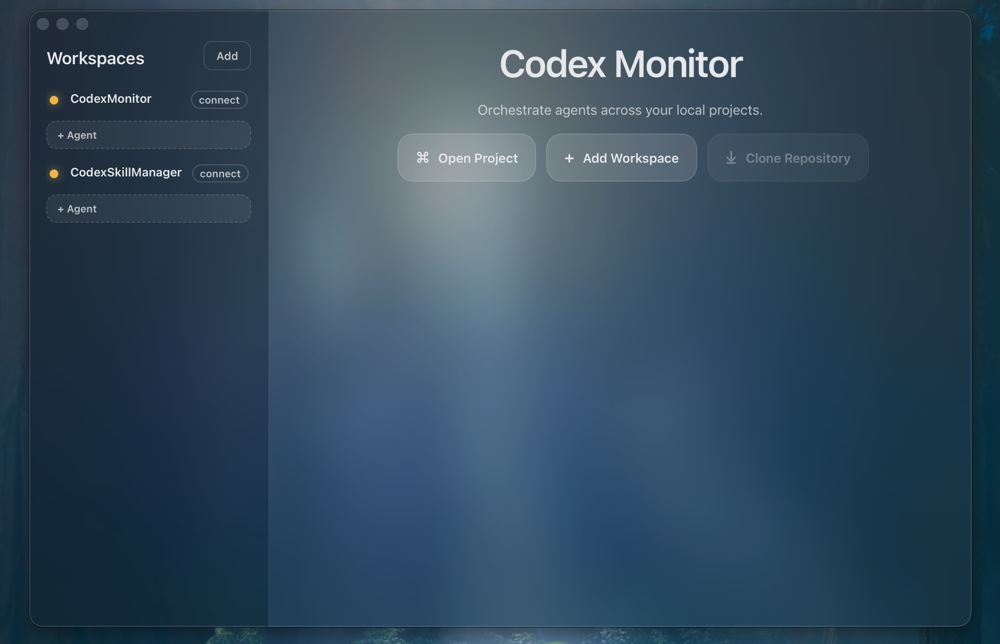

# CodexMonitor



CodexMonitor is a macOS Tauri app for orchestrating multiple Codex agents across local workspaces. It provides a sidebar to manage projects, a home screen for quick actions, and a conversation view backed by the Codex app-server protocol.

## Features (MVP)

- Add and persist workspaces using the system folder picker.
- Spawn one `codex app-server` per workspace and stream events over JSON-RPC.
- Start agent threads, send messages, and handle approvals.
- macOS overlay title bar with vibrancy effects.

## Requirements

- Node.js + npm
- Rust toolchain (stable)
- Codex installed on your system and available as `codex` in `PATH`

If the `codex` binary is not in `PATH`, update the backend to pass a custom path per workspace.

## Getting Started

Install dependencies:

```bash
npm install
```

Run in dev mode:

```bash
npm run tauri dev
```

## Project Structure

```
src/
  components/       UI building blocks
  hooks/            state + event wiring
  services/         Tauri IPC wrapper
  styles/           split CSS by area
  types.ts          shared types
src-tauri/
  src/lib.rs        Tauri backend + codex app-server client
  tauri.conf.json   window configuration
```

## Notes

- Workspaces persist to `workspaces.json` under the app data directory.
- The app uses `codex app-server` over stdio; see `src-tauri/src/lib.rs`.
